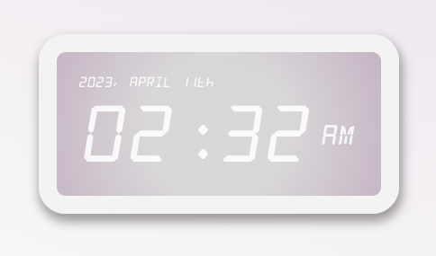

## vanilla js small exercices.

## Digital clock



- date object, padStart() method :

```javascript
const str1 = "5";

console.log(str1.padStart(2, "0"));
// Expected output: "05" -> string length : 2, add 0 before
```

## Alarm clock :

-
